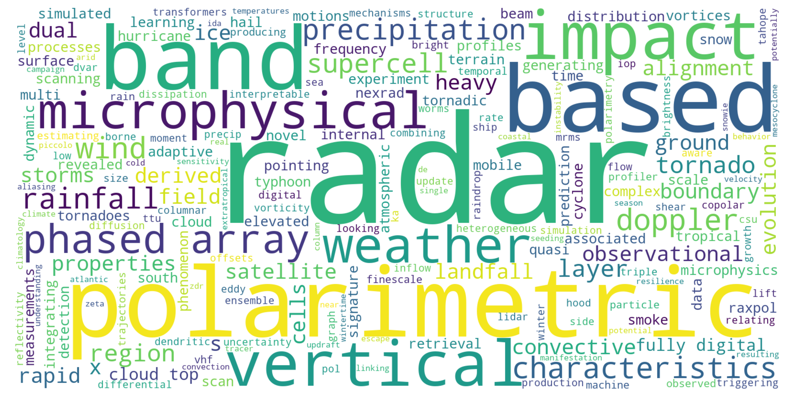

# ams-radar-2025-judging
Scripts related to judging and summarizing students' work at the 41st AMS Radar Conference

## Motivation
This repository includes notebooks used to create the final presentation for the student awards


### Figure 1 - Word Cloud


### Figure 2 - Home Institutions


## How to Run the Notebooks

1. Clone this repository and move into that directory

```bash
git clone https://github.com/mgrover1/ams-radar-2025-judging.git
cd ams-radar-2025-judging
```

2. Install the conda (mamba) environment and activate it

```bash
conda env create -f environment.yml
conda activate ams-radar-2025-judging-dev
```

3. Run the notebooks using Jupyterlab

```bash
jupyter lab
```

Notebooks are located in the `/notebooks` directory.
